A computer program is said to learn form experience E with respect to some task T and some performance measure P, if its performance on T, as measured by P, improves with experience E.

**Supervised Learning**

In supervised learning, we are given a data set and already know what our correct output should look like, having the idea that there is a relationship between the input and the output.

**Unsupervised Learning**

Unsupervised learning allows us to approach problems with little or no idea what our results should look like. We can derive structure from data where we don't necessarily know the effect of the variables.

## 1. Linear Regression with One Variable

**m** = Number of training examples

**x**'s = "input" variable / features

**y**'s = "output" / "target" variable

 

#### cost function

 

#### Gradient descent

The gradient descent algorithm is:

repeat until convergence:

 

 

## 2. Linear Algebra Review


## 3. Linear Regression with Multiple Variables

 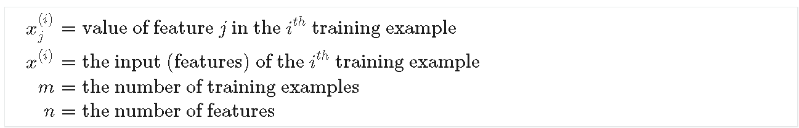

 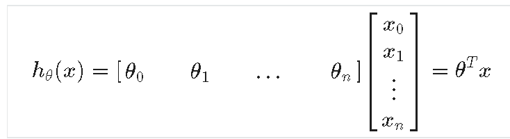

 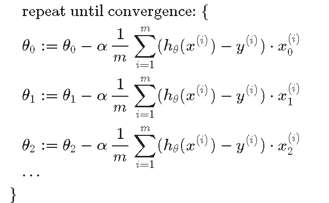

**Feature Scaling**

Get every feature into approximately a [-1, 1] range.

**Mean Normalization**

 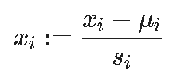

**Debugging gradient descent.** Make a plot with *number of iterations* on the x-axis. Now plot the cost function, J(θ) over the number of iterations of gradient descent. If J(θ) ever increases, then you probably need to decrease α.

**Polynomial Regression**

We can **change the behavior or curve** of our hypothesis function by making it a quadratic, cubic or square root function (or any other form).

One important thing to keep in mind is, if you choose your features this way then feature scaling becomes very important.

**Normal Equation**

  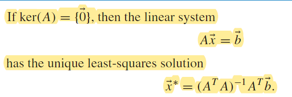

no need to do feature scaling

Slow if n is very large, Inverse is O(n&^3). Use when n < 10,000.


## 4. Octave/MatLab Tutorial

```matlab
%% Basic
disp(sprintf('%0.2f', pi));
v = 1:0.1:10;
ones(2,3); zeros(2,3);  rand(2,3);  eye(4); randn(3,3); % normal distribution
hist(x); %draw x's distribution
load name.dat;
save name.mat dataName;
save name.txt -ascii; % save as human readable
A([1 3], :);
A'; % transpose
max(A);
A < 3; % element wise operation
[c, r] = find(A >= 7);
sum(A); prod(A); floor(A); ceil(A);
A(:) % turn into vector
sum(A, 1); % sum the columns sum(A, 2) sum the rows;
flipud(A); fliplr(A);
pinv(A); % inverse of A;

%% Plot
plot(x, y); hold; close;
legend('sin', 'cons'); title('plot name');
print -dpng 'name.png'; % save as image
figure(1); figure(2); % create more windows for plot
subplot(1,2,1);
axis([0.5 1 -1 1]); % change the axis range;
imagesec(A); % print a matrix

%% Loop
for i = 1:10,
    A(i) = 2^i;
end;
while i <= 5,
	v(i) = 100;
	i = i + 1;
end;
%% Branch
if v(1) == 1,
	disp('Value is 1');
elseif v(1) == 2,
	disp('Value is 2');
else
	disp('Other values');
end;
%% Function
% filename should be functionName.m
% y: return value, x: inputs
function [y1, y2] = squareAndCube(x)
	y1 = x^2;
	y2 = x^3;

%% Using linera algebra libraries

```


## 5. Logistic Regression

**Classification**

Predict a discrete result: $h_\theta(x) = 0 \text{ or } 1$.

**Logistic Regression**

 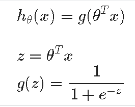

$h_\theta(x)$ will give us the **probability** that our output is 1.

 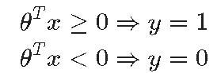

**cost function**

 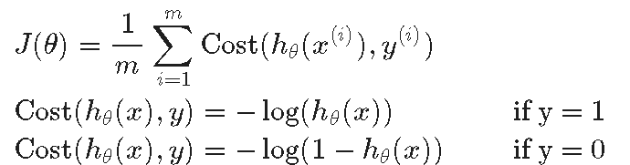

 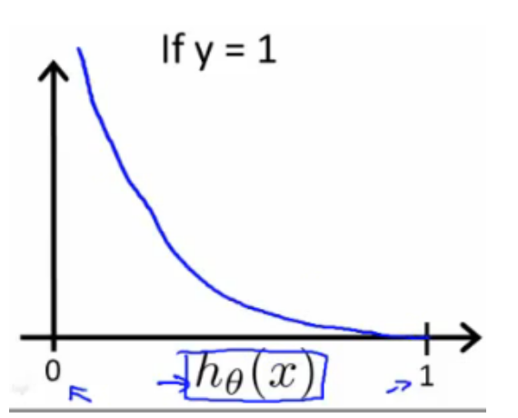

 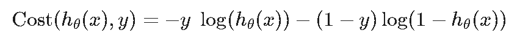

 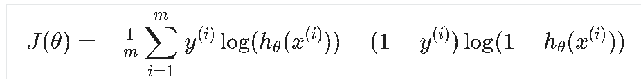

 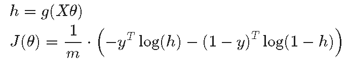

 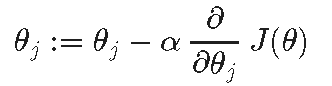

 

 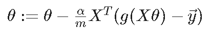

**Advanced Optimization**

```matlab
function [jVal, gradient] = costFunction(theta)
  jVal = [...code to compute J(theta)...];
  gradient = [...code to compute derivative of J(theta)...];
end

options = optimset('GradObj', 'on', 'MaxIter', 100);
initialTheta = zeros(2,1);
   [optTheta, functionVal, exitFlag] = fminunc(@costFunction, initialTheta, options);
```


## Week 4

### Neural Networks


 

$$z^{(j+1)} = \Theta^{(j)}a^{(j)}$$

$$a^{(j)} = g(z^{(j)})$$​

**AND**

 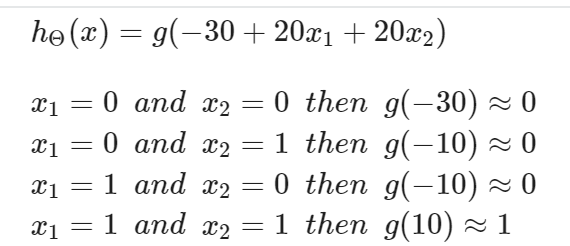

 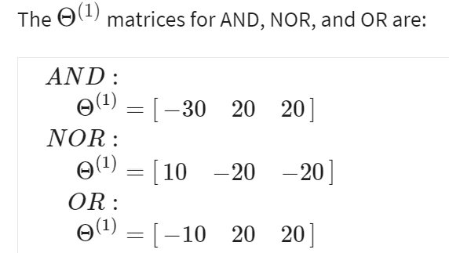

 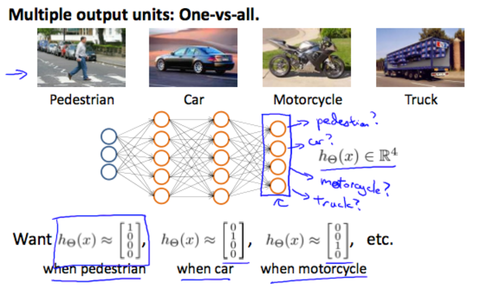


## Week5

### Cost Function

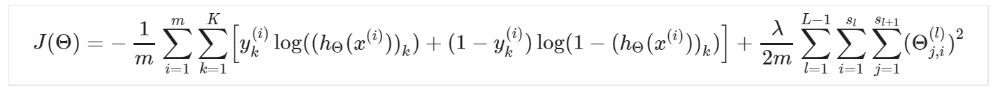

 **Backpropagation Algorithm**

"Backpropagation" is neural-network terminology for minimizing our cost function, just like what we were doing with gradient descent in logistic and linear regression. Our goal is to compute: $$min_\Theta J(\Theta)$$.

 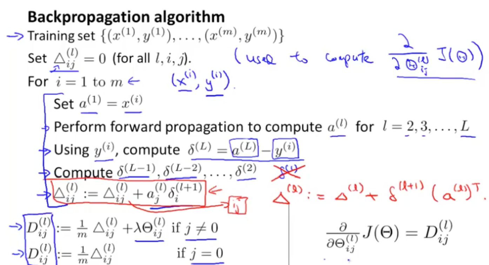

 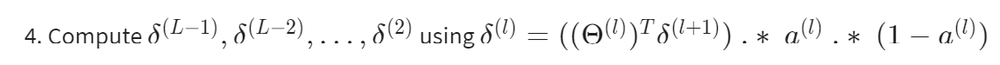

**Unrolling Parameters**

```matlab
thetaVector = [ Theta1(:); Theta2(:); Theta3(:); ];
deltaVector = [ D1(:); D2(:); D3(:) ];
Theta1 = reshape(thetaVector(1:110),10,11);
Theta2 = reshape(thetaVector(111:220),10,11);
Theta3 = reshape(thetaVector(221:231),1,11);
```

 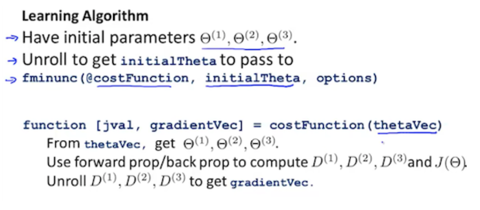

**Gradient Checking**

  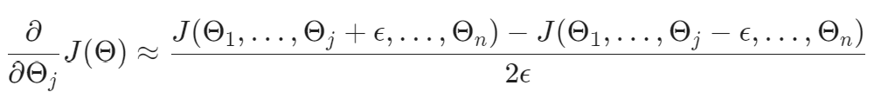

```matlab
epsilon = 1e-4;
for i = 1:n,
  thetaPlus = theta;
  thetaPlus(i) += epsilon;
  thetaMinus = theta;
  thetaMinus(i) -= epsilon;
  gradApprox(i) = (J(thetaPlus) - J(thetaMinus))/(2*epsilon)
end;
```

**Random Initialization**

Initializing all theta weights to zero does not work with neural networks. When we backpropagate, all nodes will update to the same value repeatedly. Instead we can randomly initialize our weights for our \ThetaΘ matrices using the following method:

```matlab
If the dimensions of Theta1 is 10x11, Theta2 is 10x11 and Theta3 is 1x11.

Theta1 = rand(10,11) * (2 * INIT_EPSILON) - INIT_EPSILON;
Theta2 = rand(10,11) * (2 * INIT_EPSILON) - INIT_EPSILON;
Theta3 = rand(1,11) * (2 * INIT_EPSILON) - INIT_EPSILON;
```

**Training a Neural Network**

1. Randomly initialize the weights
2. Implement forward propagation to get h_\Theta(x^{(i)})*h*Θ(*x*(*i*)) for any x^{(i)}*x*(*i*)
3. Implement the cost function
4. Implement backpropagation to compute partial derivatives
5. Use gradient checking to confirm that your backpropagation works. Then disable gradient checking.
6. Use gradient descent or a built-in optimization function to minimize the cost function with the weights in theta.


## Week6

### Evaluating a Learning Algorithm

**Test Overfitting**

A hypothesis may have a low error for the training examples but still be inaccurate (because of overfitting). Thus, to evaluate a hypothesis, given a dataset of training examples, we can split up the data into two sets: a **training set** and a **test set**. Typically, the training set consists of 70 % of your data and the test set is the remaining 30 %. 

 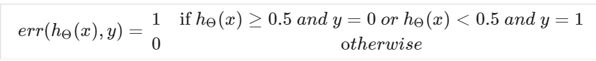

**Test Error**

 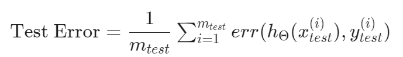

One way to break down our dataset into the three sets is:

1. Training set: 60%
2. Cross validation set: 20%
3. Test set: 20% 

We can now calculate three separate error values for the three different sets using the following method:

1. Optimize the parameters in $$\Theta$$ using the training set for each polynomial degree.
2. Find the polynomial degree d with the least error using the cross validation set.
3. Estimate the generalization error using the test set with $$J_{test}(\Theta^{(d)})$$ (d = theta from polynomial with lower error);

### Bias vs. Variance

In this section we examine the relationship between the degree of the polynomial d and the underfitting or overfitting of our hypothesis.

1. We need to distinguish whether **bias** or **variance** is the problem contributing to bad predictions.

2. High bias is underfitting and high variance is overfitting. Ideally, we need to find a golden mean between these two.

 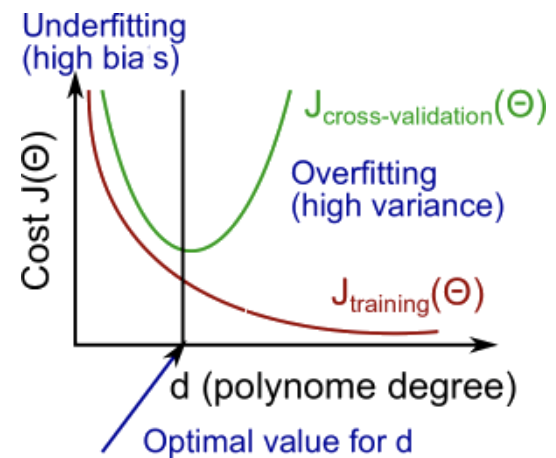

**Regularization**


 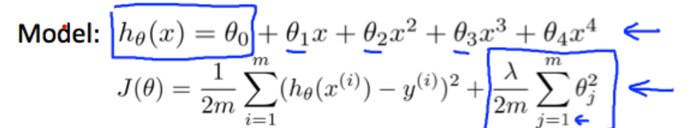

1. Create a list of lambdas (i.e. λ∈{0,0.01,0.02,0.04,0.08,0.16,0.32,0.64,1.28,2.56,5.12,10.24});
2. Create a set of models with different degrees or any other variants.
3. Iterate through the $$\lambda$$s and for each  $$\lambda$$ go through all the models to learn some $$\Theta$$.
4. Compute the cross validation error using the learned $$\Theta$$ (computed with $$\lambda$$) on the $$J_{CV}(\Theta)$$ **without** regularization or $$\lambda$$  = 0.
5. Select the best combo that produces the lowest error on the cross validation set.
6. Using the best combo $$\Theta$$ and $$\lambda$$, apply it on $$J_{test}(\Theta)$$ to see if it has a good generalization of the problem.

**Learning Curves**

**Experiencing high bias:**

If a learning algorithm is suffering from **high bias**, getting more training data will not **(by itself)** help much.

 

**Experiencing high variance:**

If a learning algorithm is suffering from **high variance**, getting more training data is likely to help.

 

*Question: how should we chose the structure of neural network based on the problem?*

Our decision process can be broken down as follows:

- **Getting more training examples:** Fixes high variance

- **Trying smaller sets of features:** Fixes high variance

- **Adding features:** Fixes high bias

- **Adding polynomial features:** Fixes high bias

- **Decreasing λ:** Fixes high bias

- **Increasing λ:** Fixes high variance.

### Building a Spam Classifier

So how could you spend your time to improve the accuracy of this classifier?

- Collect lots of data (for example "honeypot" project but doesn't always work)
- Develop sophisticated features (for example: using email header data in spam emails)
- Develop algorithms to process your input in different ways (recognizing misspellings in spam).

#### Error Analysis

The recommended approach to solving machine learning problems is to:

- Start with a simple algorithm, implement it quickly, and test it early on your cross validation data.
- Plot learning curves to decide if more data, more features, etc. are likely to help.
- Manually examine the errors on examples in the cross validation set and try to spot a trend where most of the errors were made.

### Handling Skewed Data

Skewed data is the data that has extreme ratio (e.g. cancer rate).

To avoid bad prediction (e.g. predict all 0), we should consider precision $$P$$ and recall $$R$$.

 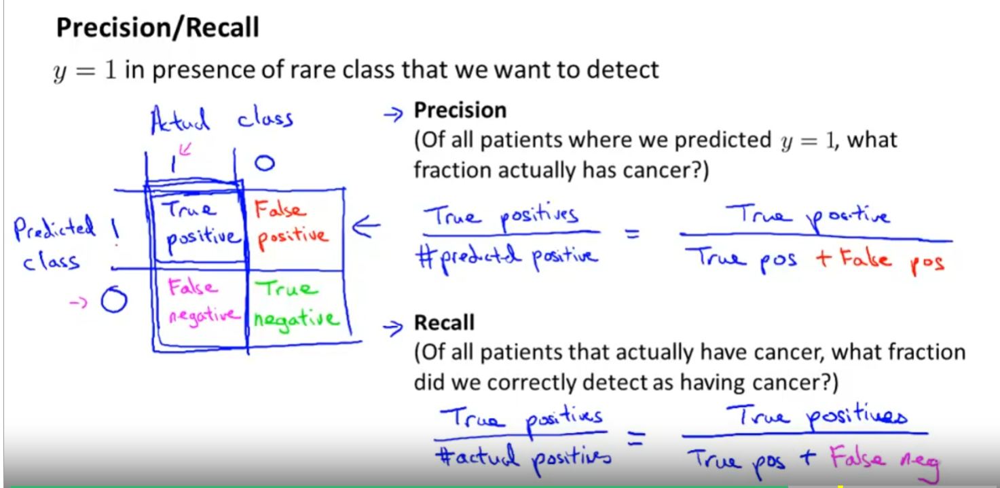

$$F_1 = \frac{2PR}{P + R}$$​​.

### Using Large Data Sets

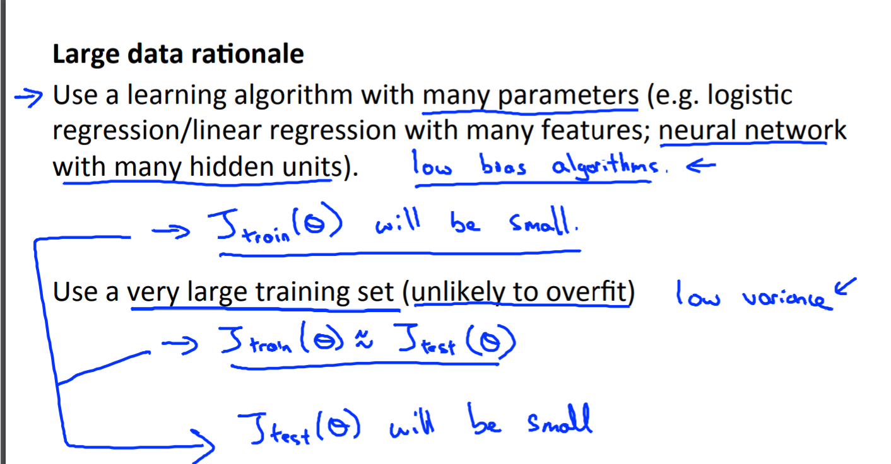 


## Week 7

### Large Margin Classification (Support Vector Machine)

 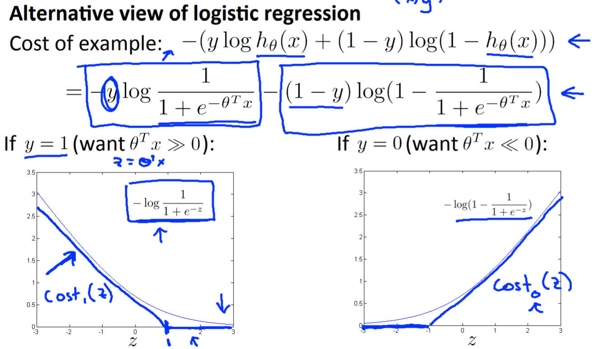

**SVM hypothesis**

$$\text{min}_\theta \,\, C \sum_{i = 1}^m[y^{(i)}cost_1(\theta^Tx^{(i)})+(1-y^{(i)})cost_0(\theta^Tx^{(i)})] + \frac{1}{2}\sum_{i=1}^n \theta_j^2$$

 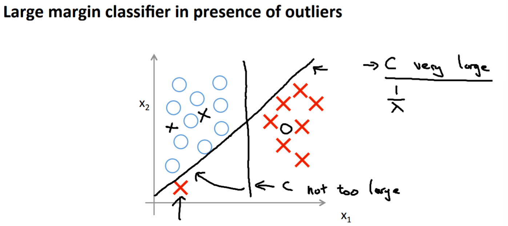

### Kernels

**Similarity function**

 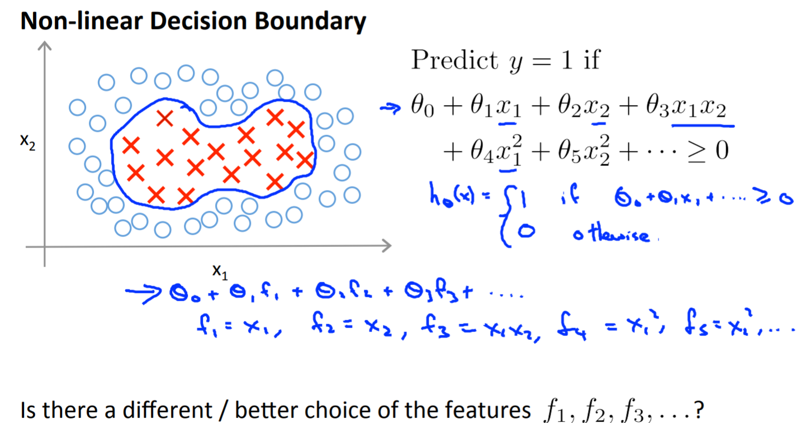

$$f = \text{exp}(-\frac{||x - L||^2}{2\sigma^2})$$

 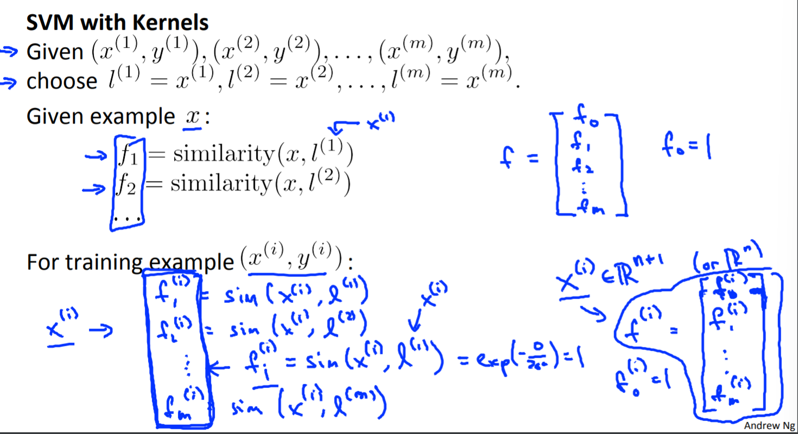

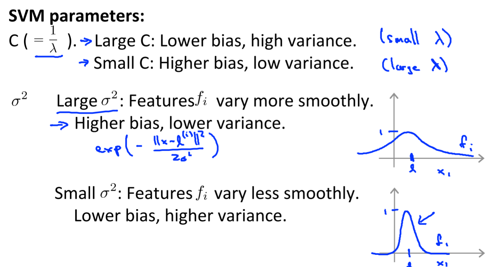 


## Week 8

### Clustering

**K-means algorithm**

Initialize K cluster centroids $$\mu_1, ..., \mu_k \in \mathbb{R}^n $$

Repeat {

​	for $i$ = 1 to $m$, $c^{(i)}$ := index of cluster centroid closest to $x^{(i)}$

​	for k = 1 to K, $\mu_k$ := average of points assigned to cluster k

}

**Cost Function**

$$J(c^{(1)}, ..., c^{(m)}, \mu_1, ..., \mu_K) = \frac{1}{m} \sum_{i = 1}^m ||x^{(i)} - \mu_{c^{(i)}}||^2$$

Also called the distortion function.

The min of cost function is exactly the process above.

**Initialization**

Randomly pick K training examples for 100 times.

Can stuck into local optima.

**Choosing the number of clusters**

 

### Dimensionality Reduction

Data compression

Visulization

**Principal Component Analysis**

feature scaling & mean normalization

$$\Sigma = \frac{1}{m}\sum_{i = 1}^n (x^{(i)})(x^{(i)})^T$$

```matlab
Sigma = 1/m * X' * X;
[U, S, V] = svd(Sigma);
U_reduce = U(:, 1:k); % n * k
z = X * U % k * m
```

**Reconstruction from Compressed Representation**

```matlab
X = U_reduce * z
```

**Choosing k**

Pick smallest values of $$k$$ for which

$$\frac{\sum_{i=1}^kS_{ii}}{\sum_{i=1}^mS_{ii}} \ge 0.99.$$​

 

Don't use PCA to address overfitting.

Run PCA only when necessary.


## Week 9

### Density Estimation

**Anomaly Detection**

**Gaussian (Normal) distribution**

$$p(x;\mu, \sigma^2) = \frac{1}{\sqrt{2\pi}\sigma}e^{-\frac{(x-\mu)^2}{2\sigma^2}}$$

 

 

Anomaly detection is often used when there are only a small number of positive examples and large number of negative examples.

Supervised learning are often used when there're large number of positive and negative eamples.

**Choose features**

Use functions such as log or ^0.1 to make the distribution into Gaussian

**Error Analysis**

If an anomaly example is not predicted right, find out what features it have, and add this feature into the model.

### Recommender System

 

**Collaborative Filtering**


