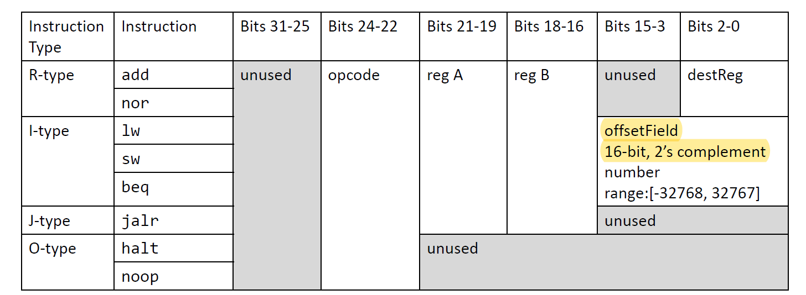
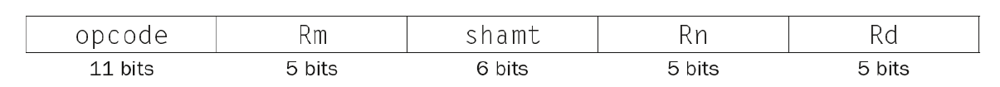
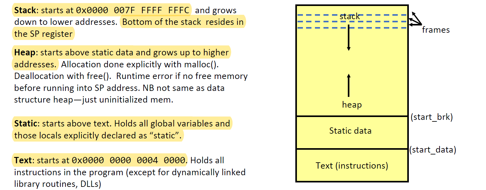
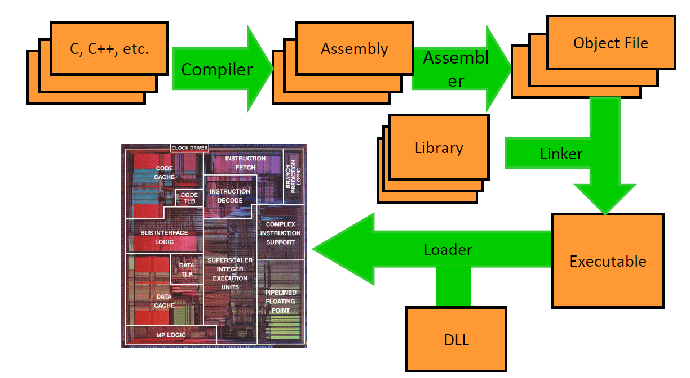
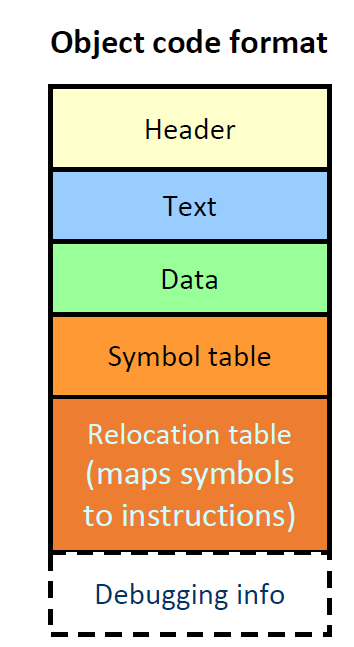

## L2 Instruction Set Architecture

An abstract interface between the hardware and the lowest-level software that encompasses all the information necessary to write a machine language program. It defines the supported instructions, data types, registers, the hardware support for managing main memory, etc. It's an specification, not hardware.

Intel Core i9/i7/i5 implements x86 ISA

Apple A9 implements ARM (Advance RISC Machine) v8-A ISA (iPhone)

**Opcode**

What instruction to perform

**Fields**

opcode + source + destination

## L3 LC2k

### Instructions and Memory

Instructions are data.

Word: usually 32 bits. (4B)

**ARMv8**

1. 32 registers
2. 64-bit wide
3. x31 is always 0
4. X30  return address
5. X28 stack pointer
6. X29 frame pointer, holds the memory address of the start of the stack frame
7. PC, cannot be accessed directly in most ISAs
8. byte addressable

**LC-2K**

1. 8 registers, 32 bits wide each
2. 2^16 = 65536 words of memory
3. word addressable

**Special Registers**

1. Return address (X30): holds the return address or link address of a subroutine
2. Stack pointer holds the memory address of the stack
3. Frame pointer: holds the memory address of the start of the stack frame
4. Program counter: point to the command to be executed
5. etc.

**Addressing**: accessing memory using address

1. Direct Addressing: load r1, M[address] (lw 40, r1, .fill address)
2. Register Indirect:  load r1, M[r2] (lw r0, r1, r2)
3. Base + Displacement: load r1, M[r2 + 4] (lw r2 r3 4)
4. Program Counter Relative: beq 0 0 start

### LC-2K ISA

**Instruction Formats**

0. add 1 2 3 : r3 = r2 add r3
1. nor 1 2 3 : r3 = r2 nor r3
2. lw 5 2 8: r2 = M[r5 + 8]
3. sw 5 2 8:  M[r5 + 8] = r2
4. beq 1 2 3: if (r1 == r2) pc += (1 + 3)
5. jalr 1 2: r2 = (pc + 1), pc = r1

.fill tells the assembler to put a number instead of an instruction

**Labels in LC-2K**

1. lw or sw: offsetField = address of the label
2. beq: PC + 1 + offsetField = address of the label

## L4 ARM-ISA

### ARM ISA Arithmetic and Logic

Register and Address: 64 bits.

Instruction: 32 bits.

ADD X3, X4, X7: X3 = X4 + X7 (note that ARM has the destination on the left)

**Instruction Fields**

shamt = shift amount

**Flags**: NZVC, record the results of (arithmetic) operations

## L5 Assembly Memory

### Assembly Data Layout

An N-byte variable must start at an address A, such that (A % N) == 0

Implication: greatly simplifies hardware needed for loads and stores. (otherwise )

### Assembly Flow Control

CBZ X3, foo: compare and branch on equal 0

CBNZ X3, 25: compare and branch on not equal 0

B.condition: EQ, NE, GE, LT, GT, LE, AL(always)

The relative address is a 19-bits signed integer-the number of instructions

**Flags**: NZVC record the result of operations including ADDS, ADDIS, SUBS, SUBIS, CMP, CMPI

N: negative  Z: zero.

**BL**: Set X30 to be the current PC+4 before it branches.

Used to call functions.

## L6 Assembly Functions

Memory map:

**string in memory**

String goes in static with a pointer to string on the heap.

### Registers Caller/Callee

**Spilling**: The process of putting less frequently used variables into memory.

**Caller save**: The caller save to the stack any register whose values it might need later.

Save it's "live" across a function call.

**Callee Save**: Each function save every register it's going to use before it does anything else.

Save if function overwrites the register.

**Caller save registers:** Callee may change, so caller responsible for saving immediately
before call and restoring immediately after call.

**Callee save registers:** Must be the same value as when called. May do this by either not
changing the value in a register or by inserting saves at the start of the function and
restores at the end

**Application Binary Interface**

Callee save: X19-X27

Caller save: X0-X15

Arguments are passed through X0-X7

Return value goes into X0

## L7 Linker, Floating Point

### Linux-ELF

**Source Code to Execution**    

hello.cpp => hello.c  => hello.o (machine language) => hello

**Executable and Likable Format**

**Header**: size of other pieces in file (text, data, symbol and relocation).

**Text**: executable code statements.

**Data**: values of initialized global, initialized static locals and leave space for uninitialized data.

**Symbol table**: associates addresses (of global, functions and local static) with global labels.

**Relocation table**: Identifies instructions and data that rely on absolute addresses (of global, static locals and functions).

### Linker

1. Take text segment from .o files and put them together.
2. Take data segment from .o files and concatenate onto end of text segment.
3. Resolve cross-file references to labels, relocate absolute references to absolute address, external reference and data reference.

### Floating Points

1. First bit: sign bit (0 is positive, 1 is negative)
2. Following 8 bits:  exponent: used biased base 127 encoding (-127) 
3. Last 23 bits: significand/mantissa (1.xxx)

