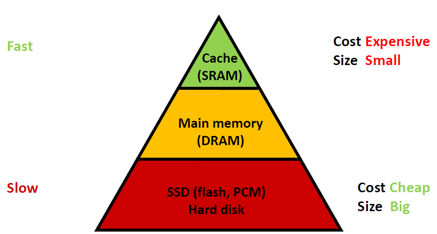
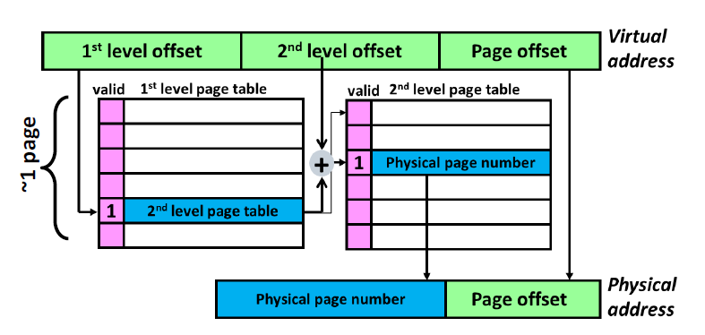
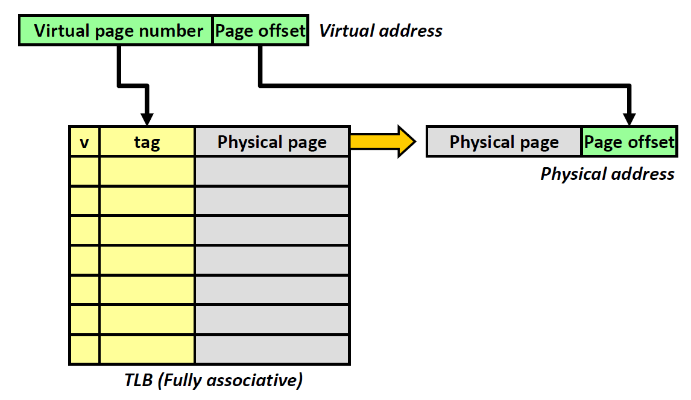
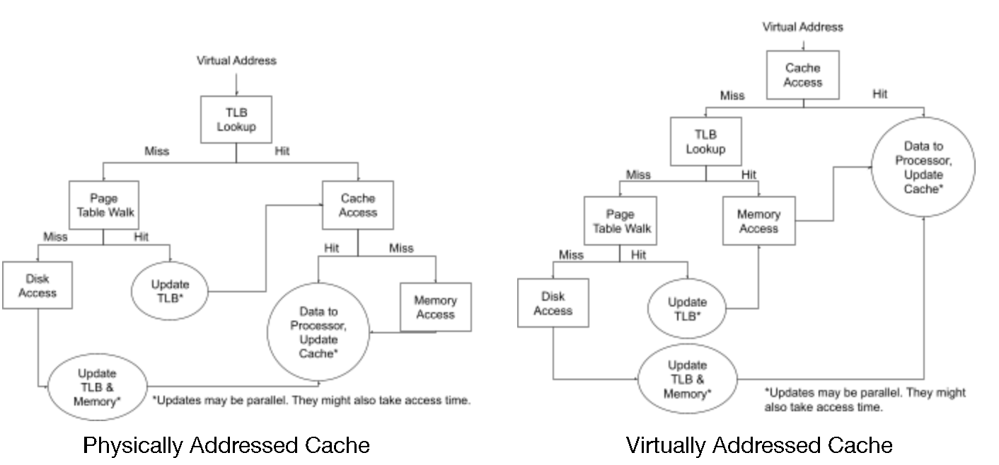

## L17 Cache and Memory Hierarchy

We want a memory system that is as fast as SRAM, but as big and cheap as a hard-disk.

We use an #hierarchy and provides #abstraction to the programmers of virtual memory.

**Cache**

Commonly refers to SRAM used on-chip within the processor.

##### Temporal Locality

If you access a memory location, you will be more likely to re-access that location.

##### LRU

Least recently used, an policy for eviction.

The data in least recently referenced (LRU) cache line should be evicted to make room for the new line.

##### AMAT

AMAT (average memory access time) 

= cache latency + memory latency * miss_rate

## L18 Block Size and Writes

Increase cache block reduces overhead.

We read a chunk from memory instead of a single byte.

![[Pasted image 20221221130655.png]]

##### Spatial Locality

If we reference a memory location, we are more likely to reference a location near it.

##### Write-Through

Write to memory for each store instruction. *high bandwidth*

##### Write-back

Write only when modified cache is evicted.

Dirty bit set when the block is stored into cache.

##### Allocate-on-write

If address X is not in the cache, we allocate address in the cache.

## L19 Direct Mapped

#### Fully-Associative Caches

Any block can go to any location. However, we need a good mechanism to determine whether the data is in the cache.

![[Pasted image 20221221132752.png]]

![[Pasted image 20221221135314.png]]

#### Direct Mapped Caches

Each memory region maps to a single cache line in which data can be placed.

![[Pasted image 20221221132916.png]]

![[Pasted image 20221221135352.png]]

Cons: only a single block from a given group can exists in the cache, causing a large miss rate.

Solution: set associative cache.

## L20 Set Associative

A mix of fully-associative cache and direct mapped cache.

![[Pasted image 20221221135526.png]]

\#blocks = cache_size / block_size

block_offset_bits = log2 (block_size)

\#sets = \#block2 / \#ways

Direct-mapped: \#sets = \#blocks

Fully-associative: \#sets = 1

set_bits = log2 (#sets)

tag_bits = address_bits - set_bits - block_offset_bits

**Compulsory:** miss on unlimited size cache

**Capacity:** miss on fully associative cache

**Conflict:** else

## L20 Cache Wrap-up

64-bit ISA word_size = 64bits

32-bit ISA word_size = 32bits

## L21 Virtual Memory Introduction

A hardware and software co-designed system that dynamically translates a virtual address to a physical address.

**Capacity**: main memory is not enough.

**Security**: Unrelated programs must not have access to each other's data.

Virtual memory is a hardware and software co-designed system that dynamically translates a virtual address to a physical address.

##### Page Table

A data structure used for address translation.

Each process has its own page table.

![[Pasted image 20221221144419.png]]

![[Pasted image 20221221144405.png]]

![[Pasted image 20221221144729.png]]

**Page Fault:** virtual page access not found in physical memory, need to find it on disk.

|             | Who decides where to store | Miss              |
| ----------- | -------------------------- | ----------------- |
| Cache       | Processor                  | Go to main memory |
| Main memory | OS                         | Go to disk        | 

OS treats main memory like an exclusive fully-associative "cache".

## L23 Hierarchical Page Table

Problem: a single page table is too big!

Solution: #hierarchy use a multi-level page table

**Page Table Entry**

Physical page number, memory/disk, permission,  dirty, LRU

Allocate 1st level page table when the process starts.

Allocate 2nd page tables on-demand.

## L24 TLB and Caches

P: address translation might need memory access, which is a large overhead.

S: cache the previous translation result and count on temporal locality, 16-512 entries common.

##### Translation Lookaside Buffer

A memory cache that stores the recent translations of virtual memory to physical memory. Part of the chip's [[Virtual Memory 482#MMU|MMU]].

Virtually addressed cache is more complicated, but faster. Common choice for L1.

On a context switch:

Virtual cache need to be invalidated.

Dirty cache blocks written back.
