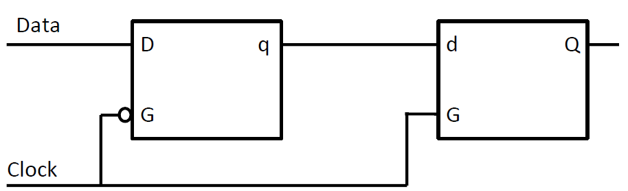

## L8 Floating Point, Arithmetic

### Floating Point

**Multiply**

1. Sign bit - xor
2. Add exponents and -127
3. Multiply significands

**Addition**

1. Shift smaller exponent right to match larger
2. Add significands
3. Normalize and update exponent

**Double**: 53 bit precision and 10 bit exponent

### Logic Gates

**Use NOR to implement all gates**

1. !A = A NOR A
2. A && B = (A NOR A) NOR (B NOR B)
3. A || B = (A NOR B) NOR (A NOR B)

**Logic Components**

Half Adder, Adder, Ripple Carry Adder

Mux, Decoder, Encoder

## L9 Sequential Logic

**Combinational logic**

Output is determined exclusively by the input.

**Sequential logic**

**SR Latch**

**D Latch**

**DFF**

**ROM (Read-Only Memory)**

Array of memory values that are constant

Define the output and state transitions.

Store the entire truth table in a memory and address it using the input.

## L10  Single Cycle Processor

**BEQ**

**JALR**

## L11 Multicycle Processor

**Fetch**

1. Read memory(PC) and store into instruction Reg
2. Calculate PC+1

**Decode**

1. Read registers
2. Use opcode to determine next state

**BEQ 4**

Time = instruction number * CPI * clock period

## L12 Pipeline Basics

**Pipeline register**

Keep track of data at each stage, stores whatever is relevant for that stage.

Fetch -> Decode -> Execute -> Memory -> Write Back

## L13 Data Hazard

**Data Dependency**

One instruction used the result of a previous one.

**Data Hazard**

One instruction has a data dependency that will cause a problem if we do not "deal with it".

#### **1. Avoid**

Puts noops between any dependent instructions.

Cons: different pipelines have different number of legacy (length).

#### **2. Detect and Stall**

**Detect**

compare regA and regB with previous destRegs

**Stall**

1. Keep current instructions in fetch and decode
2. Pass a noop to execute

**Pros** fewer noops in code, smaller executables, less fetch of code

**Cons** gets data later (when it is ready)

#### **3. Detect and Forward**

**Detect** the same as before

**Forward**

## L14 Control Hazard

The instruction fetched is not the one that is needed.

#### 1. Detect and Stall

Insert 3 noops to the IF/ID register and disable the IF/ID register for each branch instruction.

#### 2. Speculate and squash

Keep fetching from PC + 1 until we know that the branch is really taken. 

Stop bad instructions is taken.

#### 3. Branch Prediction

1. whether is branch
2. whether taken
3. if taken, the target address

**Static:** predict once during complication.

**Dynamic:**  predict many times during execution.

## L15 Pipeline Performance

Execution time = \#instructions * CPI * cycle time

speed = f / CPI

time = \#instructions + \#load stalls + 3 * \#branch stalls + 4 (empty pipe time)

Branch resolved at Execute: branch stalls penalty becomes 2
