## 6 Introduction to Computability

#### 6.1 Formal Languages

**Alphabet:** a nonempty, ==finite== set of symbols, denoted by $\Sigma$.

**String:** a sequence of symbols from $\Sigma$.

**$\Sigma^*$:** the set of all ==finite-length== strings over $\Sigma$.

**Language:** set of yes instances, a subset of $\Sigma^*$.

**Complement language:** set of inputs the answer is not yes: $\bar{L}$.

#### 6.2 Automata

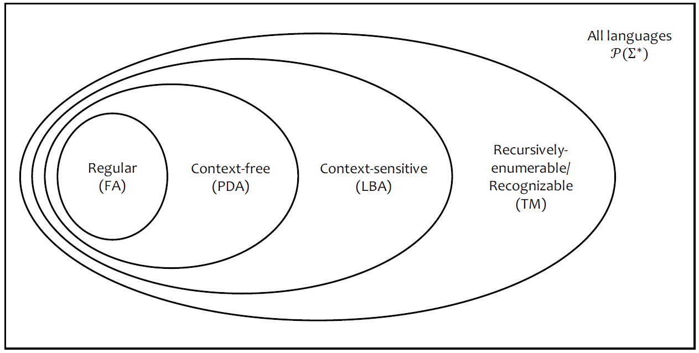

## 7 Finite Automata

Similar to FSM: finite number of states and no additional storage.

 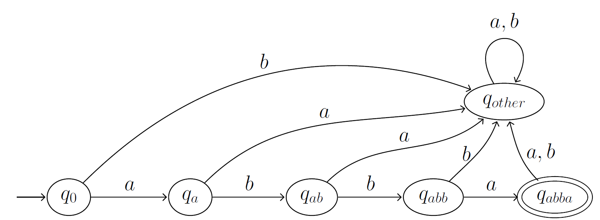

#### 7.1 Formal Definition

**$ M = (Q, \Sigma, \delta, q_o, F)$**

**$Q:$** finite set of states.

**$\Sigma :$** input alphabet.

**$\delta :$** transition function, $Q \times \Sigma \to Q$

==**$q_0 :$**== initial state.

**$F :$** accept states.

## 8 Turing Machines

We can only keep a fixed amount in our brain at any time. We model the latter using a finite set of states, with each state corresponding to a different set of information in our brain.

**Definition:**

$M = (Q,\Gamma,  \Sigma, \delta, q_{start}, q_{accept}, q_{reject})$

**$Q:$** set of states, and it must have a finite number of elements.

**$\Sigma :$** input alphabet.

**$\Gamma :$** tape alphabet. Usually, $\Gamma = \Sigma \cup \{\bot\}$, the special blank symbol.

**$\delta : (Q /F)\times \Gamma \to Q \times \Gamma \times \{L,R\}$** transition function. It takes a non-final state and a tape symbol as input, and outputs a new state a new tape symbol, and a direction (L or R).

**$q_{start} :$** initial state.

**$q_{accept} :$** accept state belongs to Q.

**$q_{reject} :$** reject state belongs to Q.

**Initial State**

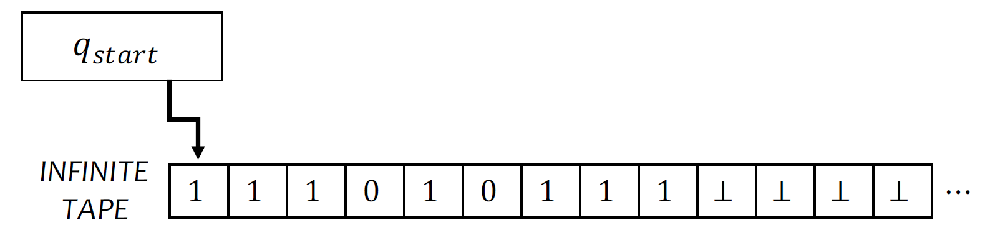

**Five steps:** check final -> reads s under the head -> transition to next state -> write a symbol s' under the head -> move head

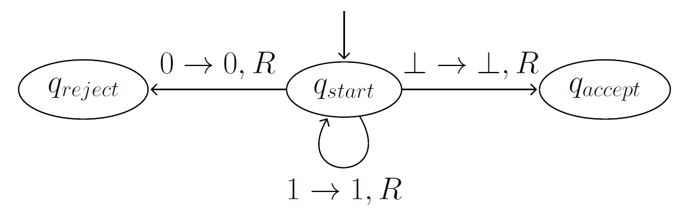

**Theorem 47 (Church-Turing Thesis):** If a function is computable by any mechanical devices, it is computable by a Turing machine.

#### 8.1 Equivalent Models

**Two-tape Turing machine** is equivalent to one-tape Turing machine.

 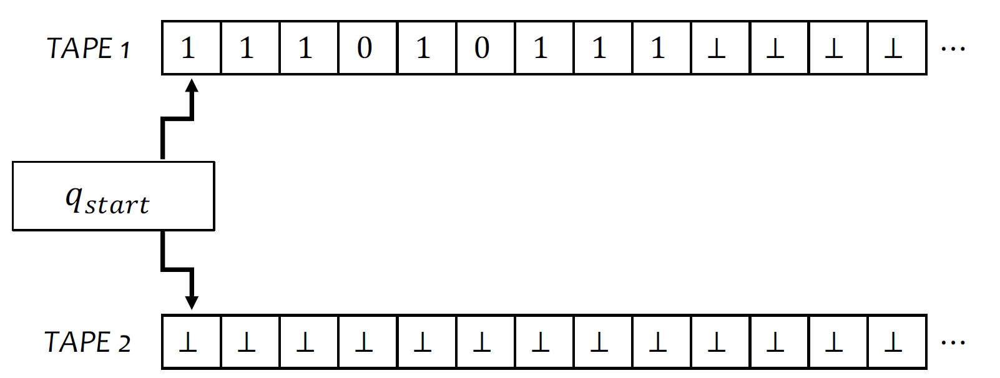

A computational model or programming language that is equivalent to the model of one-tape Turing machines is said to be Turing-complete.

#### 8.2 The Language of a Turing Machine

$L(M) := \{x: M \text{ accepts } x\}$

**Decider:** either accept or reject every input.

##### Decidable

A language 𝐴 is decidable if there exists some machine 𝑀 that decides it.

## 9 Diagonalization

Let $\mathcal{L}$ be the set of all languages, and let $\mathcal{M}$ be the set of all machines. If $|\mathcal{L} |> |\mathcal{M}|$, then there are more languages than machines, and it follows that there must be some language that does not have a corresponding machine.

#### 9.1 Countable Sets

**D48 Countable:** a set S is countable if and only if there exists a one-to-one function $f: S \to \mathbb{N}$ form $S$ to the natural numbers $\mathbb{N}$.

**Observation 49:** a set $S$ is countable if and only if we can construct a list of all the elements of $S$.

$\mathbb{Z},\mathbb{Q}$

#### 9.2 Uncountable Sets

$\mathbb{R}$, as proved by the diagonalization method.

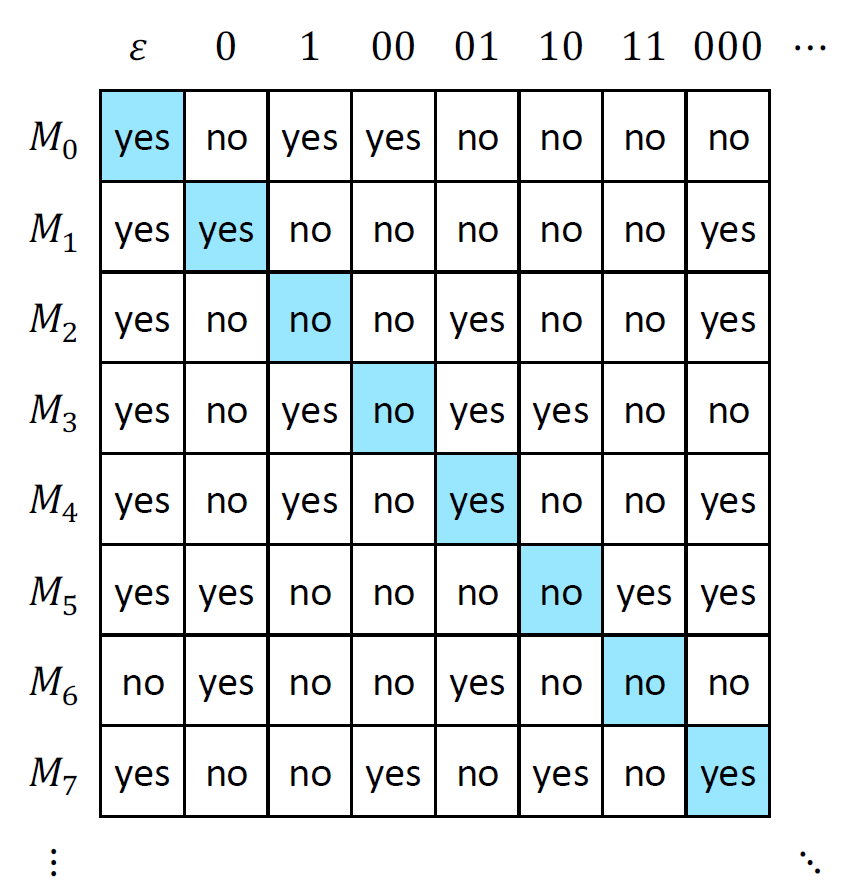

1. A language is a formalization of a decision problem.
2. A Turing machine is an abstraction of a program.
3. A machine deciding a language is a formalization of a program solving a decision problem.

### 10 The Halting Problem

Set $S$ contains all the sets that doesn't contain itself.

**$<M>$:** the source code of M

**Universal Turing machine $U$:**  input: ($<M>$,x).

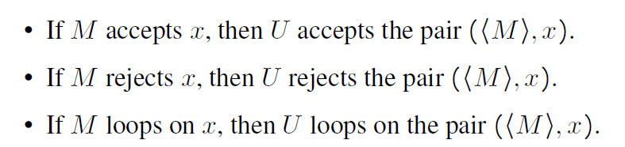

$L_{ACC} = \{(<M>, x):M \text{ is a program and } M \text{ accepts }x\}$.

**C58** There is no decider for the language $L_{ACC}$.

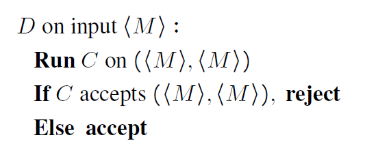

**C60** There is no decider for the language $L_{HALT}$.

## 11 Reducibility

**D63 Turing Reduction** 

Language $A$ is Turing reducible to language $B$, written $A \leq_T B$, if there exists a program $M_A$ that ==decides== $A$ using a black box $M_B$ that decides $B$.

**T64** Suppose $A \leq_T B$, then if $B$ is decidable, $A$ is also decidable.

**C66** Suppose $A \leq_T B$, then if $A$ is undecidable, $B$ is also undecidable.

$L_{HALT} \leq_T L_{\epsilon - HALT}$.

#### 11.1 Wang Tiling

$L_{TILE} = \{<S> : S \text{ is a set of tiles that admits a tiling of the entire plane }\}.$

We want to prove: $L_{\epsilon - HALT} \leq_T L_{TILE}$.

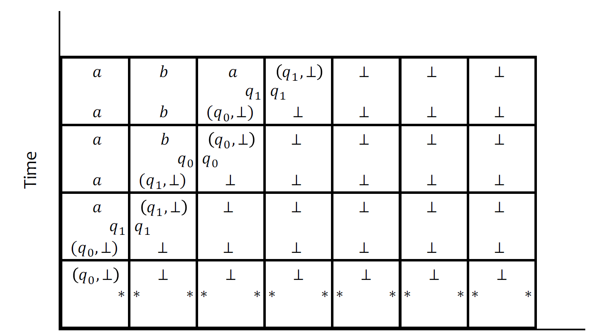

Since each row corresponds to a step of the Turing machine, the question of whether or not the quadrant can be tiled is the same as whether the machine performs infinitely many steps, i.e. whether it loops.

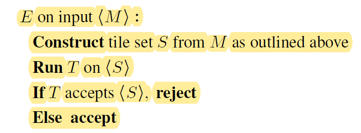

## 12 Recognizability

**Definition**

If $L(M) = A$ then we say that $M$ recognizes the language $A$.

Every machine $M$ is a recognizer for its own language $L(M)$.

A language $A$ is recognizable if there exists some machine that recognizes $A$, i.e.  $L(M) = A$.

$L_{ACC}$ is recognizable.

**Alternation**

$A_1 \cup A_2$

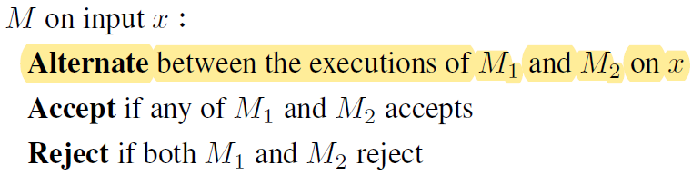

**C70** If a language $A$ and its complement $\bar{A}$ are both recognizable, then $A$ is decidable.

**C72** If $A$ is undecidable and recognizable, then $\bar{A}$ is unrecognizable.

(P.S., decidability is closed under complement, but undecidability isn't)

#### 12.1 Dovetailing

$L_\varnothing = \{\langle M \rangle : M \text{ is a program and } L(M) = \varnothing\}$

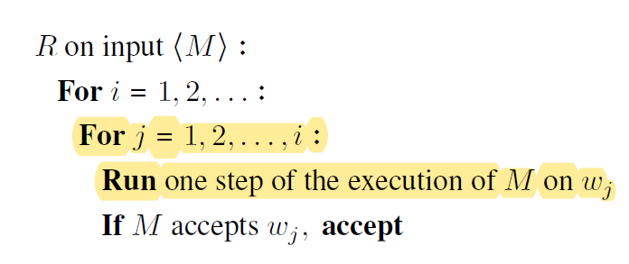

## 13 Computable Functions and Kolmogorov Complexity

Equivalence of Functional an Decision Models

**Kolmogorov complexity**

Kolmogorov complexity of $w$ in language $U$ is the length of the shortest program in $U$ that outputs $w$, given an empty string. We denote this by $K_U(w)$. 

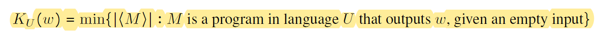

$K_U(w)$ is incomputable.

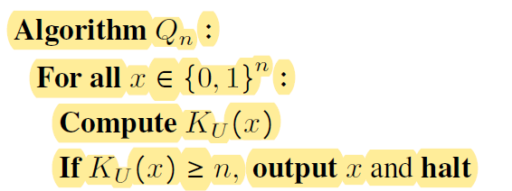

## 14 Rice's Theorem

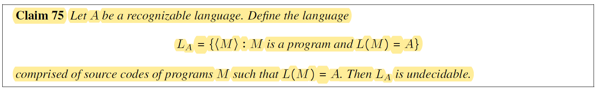

**D77 Semantic Property** is a set of languages, often denoted by $\mathbb{P}$.

**D78** A semantic property $\mathbb{P}$ is trivial if it either contains all recognizable languages, or if it contains no recognizable languages.

$L_{\mathbb{P}} = \{ \langle M \rangle : M \text{ is a program and } L(M) \in \mathbb{P}\}$

**C79** If $\mathbb{P}$ is a trivial semantic property, then $L_\mathbb{P}$ is decidable.

**T18 Rice's Theorem** 

If $\mathbb{P}$ is a nontrivial semantic property, then  $L_{\mathbb{P}} = \{ \langle M \rangle : M \text{ is a program and } L(M) \in \mathbb{P}\}$ is undecidable.
