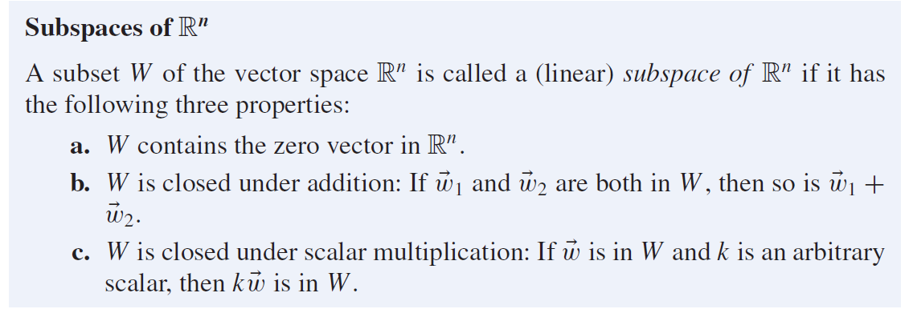
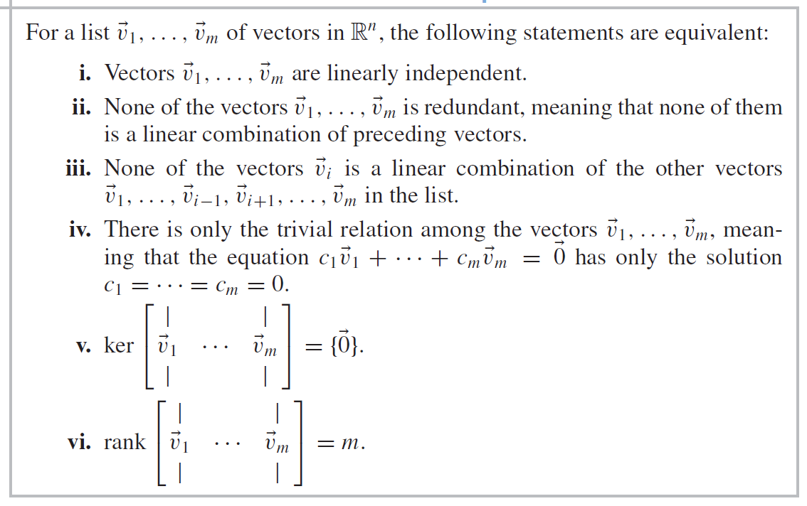
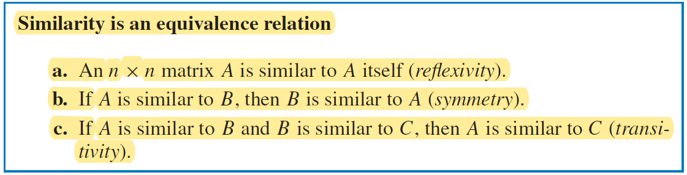

# Applied Linear Algebra

## Chapter 1 Linear Equations

### 1.2 Matrices, Vectors, and Gauss-Jordan Elimination

**coefficient Matrix:** 系数矩阵

**augmented matrix:** 增广矩阵

**Gauss-Jordan Elimination:**

**Reduced row-echelon form**

A matrix is said to be in reduced row-echelon form (rref) if it satisfies all of the following conditions:

1. If a row has nonzero entries, then the first nonzero entry is a 1, called the leading 1 (or pivot) in this row.
2. If a column contains a leading 1, then all the other entries in that column are 0.
3. If a row contains a leading 1, then each row above it contains a leading 1 further to the left. Rows of 0’s, if any, appear at the bottom of the matrix.

### 1.3 On the Solutions of Linear Systems; Matrix Algebra

**Theorem 1.3.1**

A system of equations is said to be consistent if there is at least one solution; it is inconsistent if there are no solutions

A linear system is inconsistent if (and only if) the reduced row-echelon form of its augmented matrix contains the row \[0 0 · · · 0 1\].

If a linear system is consistent, then it has either

* Infinitely many solutions (if there is at least one free variable), or
* Exactly one solution (if all the variables are leading).

**Definition 1.3.2 rank of a matrix**

The rank of a matrix A is the number of leading 1’s in rref(A), denoted rank(A).

**Theorem 1.3.3 Number of equations vs. number of unknowns**

If a linear system has exactly one solution, then there must be at least as many equations as there are variables. Equivalently, we can formulate the contrapositive:

A linear system with fewer equations than unknowns (n < m) has either no solutions or infinitely many solutions.

**Theorem 1.3.4 System of n equations in n variables**

A linear system of n equations in n variables has a unique solution if (and only if) the rank of its coefficient matrix A is n.

## Chapter 2 Linear Transformations

### 2.1 Introduction to Linear Transformations and Their Inverses

**Definition 2.1.1 Linear Transformations**

A function $T$ from $\mathbb{R}^m$ to $\mathbb{R}^n$ is called a linear transformation if there exists an $n \times m$ matrix A such that

$T(\vec{x}) = A\vec{x},$ 

for all $\vec{x}$ in the vector space $\mathbb{R}^m.$

**Theorem 2.1.2 The columns of the matrix of a linear transformation**

$A = [T(\vec{e_1}) \quad T(\vec{e_2}) \quad...\quad T(\vec{e_m})]$.

**Theorem 2.1.3 Linear Transformations**

**Definition 2.1.4 Distribution vectors and transition matrices**

A vector $\vec{x}$ in Rn is said to be a distribution vector if its components add up to 1 and all the components are positive or zero. 

A square matrix A is said to be a transition matrix (or stochastic matrix) if all its columns are distribution vectors. This means that all the entries of a transition matrix are positive or zero, and the entries in each column add up to 1.

If A is a transition matrix and $\vec{x}$ is a distribution vector, then A$\vec{x}$ will be a distribution vector as well.

### 2.2 Linear Transformations in Geometry

**Scaling**

==**Orthogonal Projection**==

**Definition 2.2.1**

==**Reflections**==

**Definition 2.2.2**

= $2P - I$

==**Orthogonal Projections and Reflections in Space**==

==**Rotation**==

**Theorem 2.2.3**

**Theorem 2.2.5 Horizontal and vertical shears** 

### 2.3 Matrix Products

**Definition 2.3.1 Matrix Multiplication**

**Definition 2.3.10 Regular transition matrices**

A transition matrix is said to be positive if all its entries are positive (meaning that all the entries are greater than 0).

A transition matrix is said to be regular (or eventually positive) if the matrix $A^m$ is positive for some positive integer m.

##### Equilibria for regular transition matrices #link (eecs485 link indexing)

### 2.4 The Inverse of a Linear Transformation

**Theorem 2.4.3 Invertibility**

**Theorem 2.4.5 Finding the inverse of a matrix**

**Theorem 2.4.9 Inverse and Determinant of a 2 * 2 matrix**

## Chapter 3 Subspace of $\mathbb{R}^n$ and Their Dimensions

### 3.1 Image and Kernel of a Linear Transformation

**Definition 3.1.2 Span**

**Theorem 3.1.3 Image of a linear transformation**

**Definition 3.1.5 Kernel**

### 3.2 Subspace of $\mathbb{R}^n$; Bases and Linear Independence

**Definition 3.2.1 Subspace of $\mathbb{R}^n$**

**Definition 3.2.3 Redundant vectors; linear independence; basis** ^3d13bb

**Theorem 3.2.5 Linear Independence and zero components**

**Definition 3.2.6 Linear Relation**

**Theorem 3.2 8 Kernel and relations**

The column vectors of A are linearly independent if (and only if) ker(A) = {$\vec{0}$}, or, equivalently, if rank(A) = m. This condition implies that m ≤ n.

**Theorem 3.2.10 Basis and unique representation**

### 3.3. The Dimension of a Subspace of $\mathbb{R}^n$

**Theorem 3.3.1**

**Theorem 3.3.2 Number of vectors in a basis**

**Definition 3.3.3**

**Theorem 3.3.4 Independent vectors and spanning vectors in a subspace of $\mathbb{R}^n$**

==**Theorem 3.3.5 Use rref to construct a basis of the image**==

==**Theorem 3.3.7 Rank-nullity theorem**==

**Find bases of the kernel and image by inspection**

**Theorem 3.3.9 Base**

### 3.4 Coordinates

**Definition 3.4.1**

**Theorem 3.4.3 The matrix of a linear transformation**

**Theorem 3.4.4 Standard matrix versus B-matrix**

**Definition 3.4.5 Similar matrices**

**Theorem 3.4.6 Similarity is an equivalence relation**

## C5 Orthogonality and Least Squares

### 5.1 Orthogonal Projections and Bases

**Definition 5.1.1**

**Definition 5.1.2**

**Theorem 5.1.3**

**Theorem 5.1.4 Orthogonal Projection**

**Theorem 5.1.5**

**Theorem 5.1.6**

**Definition 5.1.7**

**Theorem 5.1.8**

**Theorem 5.1.9**

**Theorem 5.1.11 Cauchy-Schwarz inequality**

![[Pasted image 20221221225332.png]]

##### Correlation Coefficient

![[Pasted image 20221221225433.png]]

### 5.2 Gram-Schmidt Process and QR Factorization

##### The Gram-Schmidt Process

Decompose a basis into an orthonormal basis.

![[Pasted image 20221221225615.png]]

##### QR Factorization

QR factorization is a way to express the transformation from the old basis to the new orthonormal basis. $M$ represents the old basis, while $Q$ represents the new basis.

![[Pasted image 20221221225633.png]]

### 5.3 Orthogonal Transformation and Orthogonal Matrices

![[Pasted image 20221221230435.png]]

![[Pasted image 20221221230338.png]]

![[Pasted image 20221221230515.png]]

![[Pasted image 20221221230733.png]]

![[Pasted image 20221221230718.png]]

### 5.4 Least Squares and Data Fitting

![[Pasted image 20221221231252.png]]

![[Pasted image 20221221231418.png]]

![[Pasted image 20221221231441.png]]

##### The Normal Equation

![[Pasted image 20221221231515.png]]

![[Pasted image 20221221231545.png]]

![[Pasted image 20221221231849.png]]

![[Pasted image 20221221232047.png]]

## 6 Determinants

### 6.1 Introduction to Determinants

![[Pasted image 20221221232153.png]]

![[Pasted image 20221221232215.png]]

### 6.2 Properties of Determinants

![[Pasted image 20221221232323.png]]

![[Pasted image 20221221232345.png]]

![[Pasted image 20221221232517.png]]

![[Pasted image 20221221232542.png]]

### 6.3 Geometrical Interpretations

![[Pasted image 20221221232755.png]]

![[Pasted image 20221221232811.png]]

![[Pasted image 20221221232852.png]]

We can view determinants as "volume" expanded to higher dimension.

![[Pasted image 20221221233112.png]]

![[Pasted image 20221221233054.png]]

##### Cramer's Rule

![[Pasted image 20221221233208.png]]

![[Pasted image 20221221233235.png]]

## 7 Eigenvalues and Eigenvectors #link 445

### 7.1 Diagonalization

![[Pasted image 20221221233326.png]]

![[Pasted image 20221221233441.png]]

Eigenvector is like a fixed point.

![[Pasted image 20221221233501.png]]

### 7.2 Finding the Eigenvalues

![[Pasted image 20221221234051.png]]

![[Pasted image 20221221234150.png]]

### 7.3 Finding Eigenvectors

![[Pasted image 20221221234316.png]]

![[Pasted image 20221221234359.png]]

![[Pasted image 20221221234509.png]]

![[Pasted image 20221221234548.png]]

### 7.4 Dynamic Systems #link 485 link

![[Pasted image 20221221234637.png]]

![[Pasted image 20221221234735.png]]

## 8 Symmetric Matrices and Quadratic Forms

### 8.1 Symmetric Matrices

Since we prefer orthonormal basis, we want to know for which matrices is there an orthonormal eigen basis.

![[Pasted image 20221222005759.png]]

![[Pasted image 20221222172441.png]]

![[Pasted image 20221222172642.png]]

### 8.3 Singular Values

![[Pasted image 20221222173232.png]]

![[Pasted image 20221222173435.png]]
![[Pasted image 20221222173511.png]]

![[Pasted image 20221222181110.png]]

##### SVD

![[Pasted image 20221222215433.png]]

